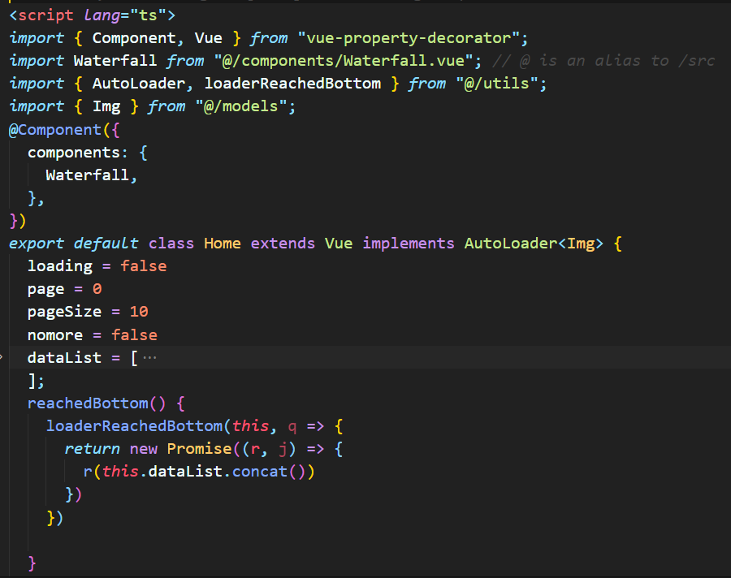

# 造轮子

关于我为什么要造轮子，原因是为了提升自己的代码能力吧~~

## 目前轮子

- **一个简单的模拟的并发队列**

[PriorityQueue](https://github.com/1360151219/Wheel/blob/master/PriorityQueue.ts)

- **一个事件总线类的实现**

[EventEmitter](https://github.com/1360151219/Wheel/blob/master/EventEmitter.ts)

- **使用 typescript 装饰器实现防抖节流功能**

> 注意这里 Options 配置中`leading`和`trailing`不能同时设置为`false`,因为如果都设置为`false`后，不触发事件后最后的一次`last=0`也无法执行，导致再次触发事件的时候会立即执行，违背了`leading=false`的本意。

[Debounce&Throttle](https://github.com/1360151219/Wheel/blob/master/Debounce.ts)

- **基于 Vue 实现的一个瀑布流组件**

[瀑布流](https://github.com/1360151219/Wheel/tree/master/Waterfall-Image/waterfall)

- **基于 Vue 实现的一个自定义表情包插件**

我们的树洞 1.2v 将要在评论引入表情包功能，因此我自己试着写了下....

[vue-emoji](https://github.com/1360151219/Wheel/tree/master/emoji)

- 参考学长的轮子实现的一个 **AutoLoader 组件**。（有些许的修改）

主要思路：判断触底，触底则执行加载函数（这里要根据`nomore`、`loading`来提前退出）。当执行用户传入的获取数据接口时，还需要将获取到的新数据 push 进原本的`dataList`中。

测试用法（在瀑布流组件中有使用示例）：

[AutoLoader](https://github.com/1360151219/Wheel/tree/master/loader)

- **Utils 工具库**

这里会放一些平时用到的自己封装的一些工具函数

- **基于 Vue 实现的可拖拽、四角可缩放的可视化弹窗**

[vue-drag](https://github.com/1360151219/Wheel/tree/master/drag)
